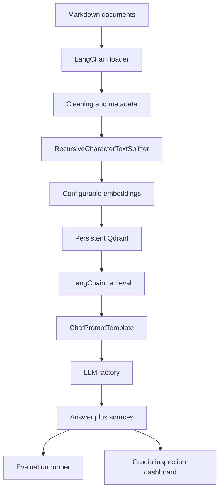
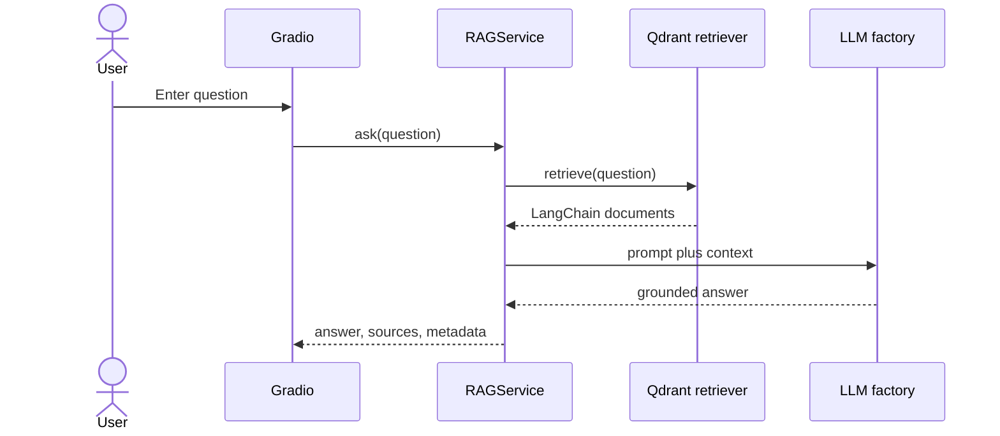

# Hospital Policy RAG

Provider-independent LangChain RAG for the Markdown hospital policy corpus. The core is independent of Gradio, vector storage, embeddings, and any particular LLM provider.

## Architecture



Recursive splitting is used because hospital policies contain headings, page markers, and prose of varying length. Chunk size and overlap are configurable.

## Structure

```text
src/rag/
  config/       typed environment settings
  ingestion/    Markdown loading, splitting, indexing
  processing/   text normalization and metadata
  embeddings/   embedding provider factory
  vectorstore/  Qdrant factory
  retrieval/    retriever configuration
  prompting/    grounded chat prompt
  llm/          OpenAI, Gemini, Groq, and Ollama adapters
  chains/       structured RAG service
  evaluation/   retrieval metrics and saved runs
scripts/        ingest.py and evaluate.py
gradio_app.py   RAG playground and evaluation dashboard
evaluation/     generated results
data/           source corpus and runtime data
```

## Setup

```powershell
py -3.12 -m venv .venv
.\.venv\Scripts\Activate.ps1
pip install -r requirements.txt
Copy-Item .env.example .env
```

Set `LLM_PROVIDER` and its credentials in `.env`. Supported providers are `openai`, `gemini`, `groq`, and `ollama`. Switching provider and model changes configuration only; retrieval, prompting, evaluation, and Gradio use the common LangChain chat-model interface. Embeddings are configured independently and default to Ollama `nomic-embed-text`.

## Docker and Ollama

```powershell
docker compose up -d --build
docker compose exec ollama ollama pull llama3.2:3b
docker compose exec ollama ollama pull nomic-embed-text
docker compose exec rag python scripts/ingest.py
```

Open Gradio at `http://localhost:7860`. CPU execution is the default; host-specific GPU passthrough can be added to Compose.

## Ingestion and RAG

```powershell
python scripts/ingest.py
python gradio_app.py
```

`IngestionService` loads Markdown, normalizes text, adds source/document metadata, splits with `RecursiveCharacterTextSplitter`, embeds chunks, and writes them to Qdrant. `RAGResponse` includes the answer, sources, retrieved chunks, provider/model, retrieval count, and latency.



## Evaluation

The existing 15-case dataset is retained at `Extra/evaluation/tests.json`. Results are saved to `evaluation/results/latest.json`.

```powershell
python scripts/evaluate.py
```

`Recall@K` measures expected sources retrieved, `Precision@K` measures relevant retrieved sources, and `MRR` rewards an expected source appearing early. These require source-level ground truth and do not measure answer faithfulness. The Gradio Evaluation tab displays aggregate and per-case results.

## Configuration and testing

All supported LLM, embedding, Qdrant, retrieval, chunking, evaluation, logging, and Gradio settings are documented in `.env.example`. Secrets are never committed or logged.

```powershell
pytest
ruff check .
python -m compileall -q src scripts gradio_app.py
```

If Ollama is unreachable, verify `OLLAMA_BASE_URL` and pull both models. If Qdrant reports a missing collection, run `python scripts/ingest.py`. If an embedding model changes, rebuild the collection rather than mixing vector dimensions. If ingestion finds no chunks, verify `DOCUMENTS_PATH` contains UTF-8 Markdown.

This system answers from approved policy documents and is not a diagnostic, prescribing, or autonomous clinical decision-support tool.
