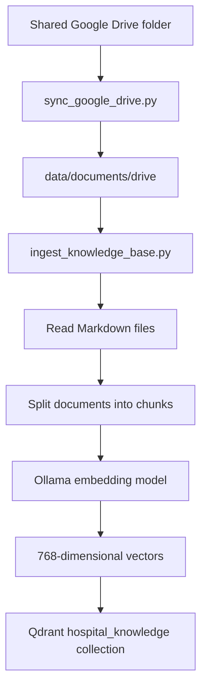
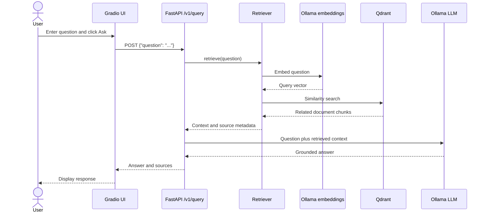

# Hospital Knowledge Assistant

Local-first hospital policy RAG application using Gradio, FastAPI, Ollama, and Qdrant.

## Structure

```text
app/
  api/       FastAPI routes
  core/      environment-backed configuration
  services/  Ollama, Qdrant, and ingestion boundaries
  ui/        Gradio interface
data/        runtime data and synced Drive documents, never committed
scripts/     operational commands
docker/      service Dockerfiles
config.yml   safe defaults and environment references
.env         local secrets and deployment values, never committed
```

## What this application does

This application is a hospital policy question-answering assistant. It downloads approved documents from a shared Google Drive folder, converts the documents into searchable vector records in Qdrant, and uses Ollama to answer user questions from the most relevant document sections.

It is a retrieval-augmented generation (RAG) application:

- **Gradio** provides the user interface.
- **FastAPI** receives questions and coordinates the RAG request.
- **Ollama `nomic-embed-text`** converts documents and questions into vectors.
- **Qdrant** finds document chunks that are semantically similar to a question.
- **Ollama `llama3.2:3b`** writes an answer using the retrieved chunks.

The assistant is grounded in approved documents. It should not be used to diagnose, prescribe, or make autonomous clinical decisions.

## Developer workflow: build the knowledge base

Run this workflow when the shared Google Drive folder is new or has changed:



Run it with:

```powershell
docker compose exec api python scripts/sync_google_drive.py
docker compose exec api python scripts/ingest_knowledge_base.py
```

What each command does:

1. `sync_google_drive.py` downloads the shared Drive files into `data/documents/drive/`.
2. `ingest_knowledge_base.py` reads the staged Markdown files.
3. `app/services/ingestion.py` splits each file into page/section chunks.
4. `app/services/ollama_client.py` creates an embedding for each chunk.
5. `app/services/qdrant_store.py` stores the vectors and document metadata in Qdrant.

The source files are not searched directly during a user question. Qdrant stores the searchable representation created by this workflow.

## End-user workflow: ask a question

When a user enters a question in Gradio and selects **Ask**, the runtime flow is:



The implementation path is:

```text
app/ui/gradio_app.py
  -> POST /v1/query
app/api/main.py
  -> Retriever.retrieve(question)
app/services/retrieval.py
  -> OllamaClient.embed(question)
  -> QdrantStore.search(vector, limit)
  -> return context and sources
app/api/main.py
  -> OllamaClient.answer(question, context)
  -> return answer and sources to Gradio
```

The user-question workflow does not download Google Drive files or create document embeddings. Those are developer/synchronization tasks performed before retrieval.

## Configuration and secrets

Copy `.env.example` to `.env` and replace the placeholder values. Do not put credentials in `config.yml`, source code, Markdown documents, or Dockerfiles. The application loads `.env`, reads `config.yml`, and resolves `${VARIABLE:default}` references at startup. In Docker, service names such as `qdrant` and `ollama` are used; outside Docker, use `localhost`.

## Run locally with Docker

```powershell
Copy-Item .env.example .env
# Edit .env and set a strong QDRANT_API_KEY if Qdrant authentication is enabled.
docker compose up -d --build
docker compose exec ollama ollama pull llama3.2:3b
docker compose exec ollama ollama pull nomic-embed-text
docker compose exec api python scripts/sync_google_drive.py
docker compose exec api python scripts/ingest_knowledge_base.py
```

The configured public Google Drive folder is downloaded into `data/documents/drive/` and then indexed in Qdrant. Run both commands again whenever the shared folder changes. The folder must remain accessible to anyone with the link. Do not use a public link for patient-identifiable or otherwise sensitive records; use an authenticated Google Drive API integration for those documents.

Open Gradio at http://localhost:7860 and the API health check at http://localhost:8000/health.

## Run without Docker

Install Python 3.12+, create a virtual environment, install `requirements.txt`, set `.env` with `QDRANT_HOST=localhost` and `OLLAMA_BASE_URL=http://localhost:11434`, then start Qdrant and Ollama separately. Run `uvicorn app.api.main:app --reload` and `python -m app.ui.gradio_app` in separate terminals.

## Security boundary

This starter is intended for approved, non-production policy content. It is not clinical decision support and must not be used to diagnose, prescribe, or expose patient records without completing authentication, authorization, audit, encryption, retention, threat modeling, and clinical safety review.
# Hospital-Management
